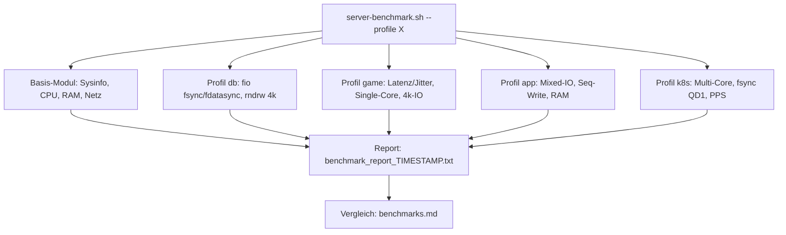

# Requirements

### Overview & Goals
Ein deutschsprachiges Konzept-Dokument `scripts/linux/benchmark-konzept.md`, das beschreibt, wie ein Linux-Server mit verschiedenen Benchmarks für die Ziel-Workloads **Game-Server, Datenbanken, Applikationen und Kubernetes** getestet werden soll. Das Konzept baut auf dem bestehenden `scripts/linux/server-benchmark.sh` und den Erfahrungen aus `scripts/linux/benchmarks.md` auf.

### Scope
**In Scope:**
- Konzept-Dokument mit Benchmark-Katalog pro Workload-Profil, Begründung der Metriken, Tool-Auswahl und Bewertungskriterien.
- Beschreibung der Ziel-Architektur des Skripts: **ein Skript mit wählbaren Profilen** (`--profile base|db|game|app|k8s|all`).
- Kubernetes nur auf **Host-Ebene** (Multi-Core-CPU, cgroup-/IO-Latenz, Netzwerk-PPS, etcd-relevante fsync-Latenz) — kein laufender Cluster nötig.
- Dokumentation bekannter Schwächen des aktuellen Skripts (fehlerhafte iperf3-Upload-Auswertung) als Verbesserungspunkt.

**Out of Scope:**
- Umsetzung/Umbau des Skripts selbst (nur Konzept).
- Container- oder Cluster-Benchmarks (Docker-Overhead, CNI, etcd im echten Cluster).

### User Stories
- Als Admin will ich vor der Server-Auswahl wissen, welche Benchmarks für meinen Workload relevant sind, um Anbieter objektiv zu vergleichen.
- Als Admin will ich pro Workload-Profil klare Zielwerte/Bewertungskriterien haben, um Ergebnisse einordnen zu können.
- Als Maintainer will ich eine klare Ziel-Architektur für das Benchmark-Skript, um es später schrittweise umzubauen.

### Functional Requirements
- Pro Workload-Profil: relevante Metriken, empfohlene Tools/Parameter, Interpretationshilfe ("gut/schlecht"-Richtwerte).
- Mapping bestehender Skript-Sektionen (1–12) auf die Profile.
- Ablaufbeschreibung: Voraussetzungen, Ausführung, Report-Format, Vergleichs-Workflow (wie in `benchmarks.md`).

# Technical Design

### Current Implementation
- `scripts/linux/server-benchmark.sh` (291 Zeilen): monolithisches Bash-Skript mit 12 Sektionen — sysbench CPU (Single-Core), RAM Read/Write, iperf3 (Down/Up gegen `speedtest.myloc.de`), Ping, sysbench fileio, fio Multi-Blocksize 70/30, fio fsync=1 (DB-Commit), fio QD1 fdatasync, fio parallele Sync-Writes QD4/QD16, fio 1M Sequential Write; komprimierte Zusammenfassung via `tee` in `benchmark_report_*.txt`.
- `scripts/linux/benchmarks.md`: Auswertungs-/Vergleichsdokument (4 Anbieter) mit dokumentiertem Bug: **Upload-Zeile fehlerhaft formatiert** (Zeile 201–202 im Skript: `awk '{print $(NF-2), $(NF-1)}'` vertauscht Zahl/Einheit, teils 0-Werte).

### Key Decisions
- **Nur Konzept-Dokument** (Entscheidung des Users): keine Skript-Änderungen in diesem Task.
- **Ziel-Architektur: ein Skript mit Profilen** — im Konzept beschrieben als `server-benchmark.sh --profile <base|db|game|app|k8s|all>` mit gemeinsamer Basis (CPU/RAM/Disk/Netz) plus profil-spezifischen Modulen.
- **Kubernetes nur Host-Ebene** — keine Container-/Cluster-Voraussetzungen.

### Proposed Changes
Neue Datei `scripts/linux/benchmark-konzept.md` (deutsch, Stil wie `benchmarks.md`) mit folgender Struktur:
1. **Ziel & Workloads** — Überblick über die 4 Einsatzzwecke.
2. **Benchmark-Matrix** — Tabelle: Metrik × Workload-Relevanz (z. B. fsync-Latenz → DB/K8s-etcd kritisch; Single-Core-CPU + Netzwerk-Jitter → Game-Server; Multi-Core → K8s/Apps).
3. **Profile im Detail:**
   - `base`: Systeminfo, sysbench CPU Single- **und Multi-Core**, RAM R/W, iperf3, Ping (deckt Sektionen 1–6 ab, ergänzt Multi-Core).
   - `db`: fio fsync=1, QD1 fdatasync, parallele Sync-Writes, sysbench fileio rndrw (Sektionen 7, 9–11); optional sysbench OLTP als Ausblick.
   - `game`: Latenz/Jitter-Fokus (ping mehrere Ziele, iperf3 UDP-Jitter), Single-Core-CPU, 4k-Random-IO (Sektion 8/4k).
   - `app`: Mixed-IO über Blockgrößen (Sektion 8), sequentielle Transfers (Sektion 12), RAM-Durchsatz.
   - `k8s` (Host-Ebene): Multi-Core-CPU-Skalierung, fdatasync-QD1-Latenz (etcd-Proxy-Metrik, Richtwert <10 ms wal_fsync), Netzwerk-PPS/parallele Streams, viele kleine parallele IOs.
4. **Ziel-Skript-Architektur** — Mermaid-Diagramm + CLI-Design (`--profile`, `--report-dir`), Mapping bestehender Sektionen auf Profile.
5. **Bekannte Mängel & Fixes** — iperf3-Upload-Parsing (Empfehlung: `iperf3 --json` + `jq`), Zap-4k-Page-Cache-Anomalie.
6. **Durchführung & Auswertung** — Voraussetzungen (Pakete), Wiederholungen, Vergleich per `benchmarks.md`-Vorlage, Interpretations-Richtwerte.

### Architecture Diagram (Ziel-Skript, im Konzept enthalten)

### File Structure
- **Neu:** `scripts/linux/benchmark-konzept.md`
- **Unverändert:** `scripts/linux/server-benchmark.sh`, `scripts/linux/benchmarks.md` (wird im Konzept nur referenziert)

# Testing

### Validation Approach
Da nur ein Markdown-Dokument entsteht, erfolgt die Validierung durch Review-Kriterien:

### Key Scenarios
- Jedes der 4 Workload-Profile (Game, DB, App, K8s) hat einen eigenen Abschnitt mit Metriken, Tools/Parametern und Interpretationshilfe.
- Alle 12 Sektionen des bestehenden Skripts sind einem Profil zugeordnet (vollständiges Mapping, keine verwaiste Sektion).
- Die Ziel-Architektur (`--profile`-Design) ist mit Mermaid-Diagramm beschrieben.
- Der bekannte iperf3-Upload-Bug ist mit konkretem Fix-Vorschlag dokumentiert.

### Edge Cases
- K8s-Abschnitt setzt keinerlei Container/Cluster voraus (Host-Ebene, Vorgabe des Users).
- Konsistente Terminologie/Einheiten mit `benchmarks.md` (MiB/s, IOPS, ms).

# Delivery Steps

### ✓ Step 1: Konzept-Grundgerüst mit Benchmark-Matrix erstellen
`scripts/linux/benchmark-konzept.md` existiert mit Zielsetzung, Workload-Übersicht und Benchmark-Matrix.

- Neue Datei `scripts/linux/benchmark-konzept.md` anlegen (deutsch, Stil analog `benchmarks.md`).
- Abschnitt "Ziel & Workloads" für Game-Server, Datenbanken, Applikationen, Kubernetes schreiben.
- Benchmark-Matrix (Tabelle Metrik × Workload-Relevanz) erstellen: CPU Single-/Multi-Core, RAM, Netzwerk-Durchsatz/Latenz/Jitter, Random-IO, fsync-Latenz, Sequential-IO.

### ✓ Step 2: Workload-Profile im Detail ausarbeiten
Jedes der 5 Profile (base, db, game, app, k8s) hat einen Abschnitt mit Tools, Parametern und Interpretationshilfe.

- `base`: Systeminfo, sysbench CPU (Single- + neu Multi-Core), RAM R/W, iperf3, Ping.
- `db`: fio fsync=1 / QD1 fdatasync / parallele Sync-Writes, sysbench fileio; Richtwerte für Commit-Latenz.
- `game`: Latenz/Jitter (Ping mehrere Ziele, iperf3 UDP), Single-Core-CPU, 4k-Random-IO.
- `app`: Mixed-IO über Blockgrößen, 1M Sequential Write, RAM-Durchsatz.
- `k8s` (nur Host-Ebene): Multi-Core-Skalierung, fdatasync-QD1 als etcd-Proxy-Metrik (<10 ms Richtwert), Netzwerk mit vielen parallelen Streams.
- Mapping-Tabelle: bestehende Skript-Sektionen 1–12 → Profile.

### ✓ Step 3: Ziel-Architektur, bekannte Mängel und Auswertungs-Workflow dokumentieren
Das Konzept beschreibt die Ziel-Skript-Architektur mit Profilen, bekannte Bugs und den Vergleichs-Workflow.

- Abschnitt "Ziel-Architektur": CLI-Design `server-benchmark.sh --profile base|db|game|app|k8s|all` mit Mermaid-Diagramm.
- Abschnitt "Bekannte Mängel & Fixes": iperf3-Upload-Parsing-Bug (Skript Zeilen 201–202) mit Fix-Empfehlung (`iperf3 --json` + `jq`), Hinweis auf Page-Cache-Anomalien bei 4k-Tests.
- Abschnitt "Durchführung & Auswertung": Paket-Voraussetzungen (sysbench, fio, iperf3), Wiederholungsempfehlung, Report-Format und Vergleich nach Vorlage von `benchmarks.md`.
- Abschließender Konsistenz-Check: alle Skript-Sektionen zugeordnet, Einheiten konsistent.