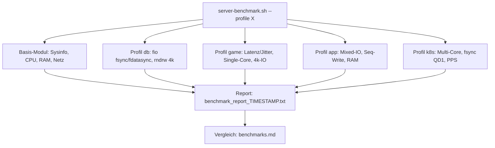

# Benchmark-Konzept: Linux-Server für Game-Server, Datenbanken, Applikationen & Kubernetes

*Erstellt am 24.08.2026*

Dieses Konzept beschreibt, wie ein Linux-Server mit verschiedenen Benchmarks auf seine Eignung für die Ziel-Workloads **Game-Server, Datenbanken, Applikationen und Kubernetes** getestet werden soll. Es baut auf dem bestehenden Skript [`server-benchmark.sh`](server-benchmark.sh) und den Erfahrungen aus dem Server-Vergleich [`benchmarks.md`](benchmarks.md) auf.

---

## 1. Ziel & Workloads

Ziel ist ein reproduzierbarer, vergleichbarer Benchmark-Lauf, mit dem verschiedene Server/Anbieter objektiv bewertet werden können — abgestimmt auf den geplanten Einsatzzweck. Die vier Ziel-Workloads stellen unterschiedliche Anforderungen an die Hardware:

### Game-Server
- **Latenz-kritisch:** Tick-Raten (z. B. 20–128 Ticks/s) erfordern konstant niedrige Netzwerk-Latenz und minimalen Jitter.
- **Single-Core-lastig:** Viele Game-Engines (Minecraft, Source-Engine, ARK) skalieren schlecht über Kerne — die Single-Core-Leistung entscheidet.
- Disk-I/O ist sekundär (Welt-Saves, Chunk-Loading → 4k-Random-Reads).

### Datenbanken
- **fsync-Latenz ist die Schlüsselmetrik:** Bei synchronen Commits (PostgreSQL `synchronous_commit=on`, MySQL `innodb_flush_log_at_trx_commit=1`) bestimmt die Flush-Latenz die maximale Transaktionsrate.
- Random-4k-IOPS (Read/Write gemischt) für Index-/Heap-Zugriffe.
- RAM-Durchsatz für Buffer-Cache/Shared Buffers.

### Applikationen (Web-/App-Server, CI, allgemeine Dienste)
- Ausgewogenes Profil: Mixed-I/O über verschiedene Blockgrößen, sequentielle Transfers (Deployments, Logs, Backups), RAM-Durchsatz.
- Multi-Core-CPU für parallele Requests/Builds.

### Kubernetes (Host-Ebene)
- Bewertet wird die **Eignung des Hosts als K8s-Node** — ohne laufenden Cluster oder Container-Runtime.
- **Multi-Core-Skalierung:** Viele parallele Pods → CPU-Leistung muss über alle Kerne skalieren.
- **etcd-Proxy-Metrik:** etcd verlangt niedrige `wal_fsync`-Latenz (Richtwert **< 10 ms**, ideal < 2 ms) → messbar per fio `fdatasync` bei QD1.
- Netzwerk: viele parallele Streams/Verbindungen (Service-Traffic, Overlay-Netz), nicht nur Peak-Bandbreite.
- Viele kleine parallele I/Os (Container-Layer, Logs, emptyDir).

---

## 2. Benchmark-Matrix

Relevanz der Metriken pro Workload: **●●●** kritisch · **●●** wichtig · **●** nice-to-have · **–** irrelevant

| Metrik | Tool | Game-Server | Datenbank | Applikation | Kubernetes |
|---|---|---|---|---|---|
| CPU Single-Core (events/s) | sysbench cpu `--threads=1` | ●●● | ●● | ●● | ● |
| CPU Multi-Core (events/s) | sysbench cpu `--threads=$(nproc)` | ● | ●● | ●●● | ●●● |
| RAM Write/Read (MiB/s) | sysbench memory | ● | ●● | ●● | ●● |
| Netzwerk-Durchsatz Down/Up | iperf3 (TCP, parallel) | ●● | ● | ●● | ●● |
| Netzwerk-Latenz (ms) | ping | ●●● | ● | ●● | ●● |
| Netzwerk-Jitter (ms) | ping mdev / iperf3 UDP | ●●● | – | ● | ●● |
| Netzwerk parallele Streams/PPS | iperf3 `-P 10+` / UDP | ● | – | ● | ●●● |
| Random-I/O 4k (IOPS, Latenz) | sysbench fileio / fio randrw | ●● | ●●● | ●● | ●● |
| Mixed-I/O über Blockgrößen (4k–1m) | fio randrw 70/30 | ● | ●● | ●●● | ●● |
| fsync-Latenz (ms) | fio `fsync=1` / `fdatasync=1` | – | ●●● | ● | ●●● (etcd) |
| Sync-Write-Skalierung (QD1→QD16) | fio `fdatasync=1`, iodepth | – | ●●● | ● | ●● |
| Sequential Write 1M (MiB/s) | fio `bs=1m` | – | ● | ●● | ● |

**Ableitung:** Ein Server, der für *alle* vier Workloads taugen soll, muss vor allem in drei Dimensionen überzeugen: (1) fsync-Latenz < 2 ms (DB + etcd), (2) solide Single- *und* Multi-Core-CPU, (3) niedrige, stabile Netzwerk-Latenz mit geringem Jitter.

---

## 3. Profile im Detail

Die Benchmarks werden in **5 wählbare Profile** gegliedert. `base` läuft immer mit; die Workload-Profile ergänzen spezifische Tests.

### 3.1 Profil `base` — Grundlage für jeden Vergleich

Deckt die bestehenden Skript-Sektionen **1–6** ab und ergänzt einen Multi-Core-CPU-Test.

| Test | Tool / Parameter | Metrik |
|---|---|---|
| Systeminfo | `/proc/cpuinfo`, `nproc`, `/etc/os-release`, `uname -r` | CPU-Modell, Kerne, OS, Kernel |
| CPU Single-Core | `sysbench cpu --threads=1 --cpu-max-prime=20000 --time=30` | events/s |
| CPU Multi-Core **(neu)** | `sysbench cpu --threads=$(nproc) --cpu-max-prime=20000 --time=30` | events/s + Skalierungsfaktor (Multi/Single) |
| RAM Write | `sysbench memory --memory-block-size=1M --memory-total-size=10G --memory-oper=write` | MiB/s |
| RAM Read | `sysbench memory ... --memory-oper=read` | MiB/s |
| Netz Upload | `iperf3 -c speedtest.myloc.de -p 5200 -P 10 -4` | Gbit/s (SUM sender) |
| Netz Download | `iperf3 ... -R` | Gbit/s (SUM receiver) |
| Latenz | `ping -c 10 8.8.8.8` | avg / mdev (Jitter) in ms |

**Interpretation:**
- Single-Core: > 2000 events/s sehr gut (vgl. Zap 2648), < 1500 schwach für Game-Server.
- Skalierungsfaktor Multi/Single: nahe `nproc` = saubere Skalierung; deutlich darunter → Hinweis auf geteilte vCPUs/Steal-Time.
- Jitter (mdev): < 0,1 ms sehr gut, > 1 ms für Game-Server problematisch.

### 3.2 Profil `db` — Datenbanken

Deckt die Sektionen **7, 9, 10, 11** ab.

| Test | Tool / Parameter | Metrik |
|---|---|---|
| Random R/W 4k | `sysbench fileio --file-test-mode=rndrw --file-block-size=4K --threads=4 --file-extra-flags=direct` (Sektion 7) | MiB/s Read/Write, 95p-Latenz |
| DB-Sync-Simulation | `fio --bs=4k --iodepth=32 --rw=randrw --rwmixread=70 --numjobs=4 --fsync=1` (Sektion 9) | IOPS, fsync-Latenz |
| Commit-Latenz QD1 | `fio --bs=4k --iodepth=1 --rw=write --fdatasync=1` (Sektion 10) | fdatasync-Latenz (avg) |
| Parallele Sync-Writes | `fio --bs=4k --iodepth=4/16 --rw=write --fdatasync=1` (Sektion 11) | IOPS-Skalierung QD1→QD4→QD16 |

**Interpretation (Richtwerte Commit-Latenz):**
- fsync/fdatasync avg **< 1 ms**: exzellent (Enterprise-NVMe) · **1–3 ms**: gut (vgl. Strato 1,92 ms / Hetzner neu 1,95 ms) · **3–10 ms**: brauchbar · **> 10 ms**: für synchrone Commits ungeeignet (vgl. Zap 63,3 ms).
- IOPS sollten von QD1 zu QD16 deutlich steigen; stagnieren sie, limitiert die Flush-Latenz.
- *Ausblick:* `sysbench oltp_read_write` gegen lokale MySQL/PostgreSQL-Instanz als realitätsnaher End-to-End-Test (nicht Teil des Basis-Skripts, da DB-Installation nötig).

### 3.3 Profil `game` — Game-Server

Fokus: Latenz, Jitter, Single-Core.

| Test | Tool / Parameter | Metrik |
|---|---|---|
| Latenz mehrere Ziele **(neu)** | `ping -c 20` gegen z. B. `8.8.8.8`, `1.1.1.1`, regionalen Speedtest-Host | avg + mdev pro Ziel |
| UDP-Jitter **(neu)** | `iperf3 -u -b 100M -c <host>` | Jitter (ms), Paketverlust (%) |
| CPU Single-Core | wie `base` (Sektion 1) | events/s |
| 4k-Random-I/O | fio-Blocksize-Test, nur `bs=4k` (Sektion 8) | IOPS, Latenz |

**Interpretation:**
- UDP-Jitter < 1 ms und 0 % Loss: sehr gut; > 5 ms Jitter → spürbares Ruckeln bei hohen Tick-Raten.
- Ping-mdev über mehrere Ziele vergleichen — ein einzelnes Ziel kann Peering-Effekte verzerren.
- Single-Core ist hier das primäre CPU-Kriterium (siehe `base`-Richtwerte).

### 3.4 Profil `app` — Applikationen

Deckt die Sektionen **8 und 12** ab.

| Test | Tool / Parameter | Metrik |
|---|---|---|
| Mixed-I/O Blockgrößen | fio randrw 70/30, `bs=4k/64k/512k/1m`, QD32, 4 Jobs (Sektion 8) | MiB/s + IOPS pro Blockgröße |
| 1M Sequential Write | `fio --bs=1m --iodepth=4 --rw=write` (Sektion 12) | MiB/s Dauerlast |
| RAM-Durchsatz | wie `base` (Sektionen 2–3) | MiB/s |

**Interpretation:**
- Durchsatz sollte mit der Blockgröße deutlich steigen (vgl. Hetzner neu: 434 MiB/s @4k → 8231 MiB/s @1m); flacher Verlauf deutet auf künstliche Limits (Rate-Limiting des Anbieters).
- Sequential Write zeigt, ob der Wert unter Dauerlast einbricht (SLC-Cache-Erschöpfung bei QLC-SSDs).

### 3.5 Profil `k8s` — Kubernetes (nur Host-Ebene)

Kein Cluster, keine Container-Runtime erforderlich — bewertet wird der Host als potenzieller Node.

| Test | Tool / Parameter | Metrik | K8s-Bezug |
|---|---|---|---|
| Multi-Core-Skalierung | `sysbench cpu --threads=1/2/4/…/$(nproc)` | events/s pro Stufe | viele parallele Pods |
| etcd-Proxy-Metrik | fio QD1 `fdatasync=1` (Sektion 10) | fdatasync-Latenz | etcd `wal_fsync_duration`: **< 10 ms** (99p) zwingend, ideal < 2 ms |
| Parallele Streams | `iperf3 -P 10` (Sektionen 4–5), optional `-P 30` | SUM-Durchsatz, Stabilität | Service-/Overlay-Traffic |
| Viele kleine parallele I/Os | fio `bs=4k --numjobs=8 --iodepth=16 --rw=randrw` | IOPS, 99p-Latenz | Container-Layer, Logging, emptyDir |

**Interpretation:**
- fdatasync-Latenz ist das K.-o.-Kriterium: > 10 ms → als Control-Plane-Node (etcd) ungeeignet, als reiner Worker noch akzeptabel.
- CPU-Skalierung: bricht die Kurve früh ab (Steal-Time, geteilte vCPUs), ist der Host für dichte Pod-Belegung ungeeignet.

### 3.6 Mapping: bestehende Skript-Sektionen → Profile

| Sektion (aktuelles Skript) | Test | Profil(e) |
|---|---|---|
| Systeminfo | CPU/OS/Kernel | `base` |
| 1 | sysbench CPU Single-Core | `base`, `game` |
| 2 | RAM Write | `base`, `app` |
| 3 | RAM Read | `base`, `app` |
| 4 | iperf3 Upload | `base`, `k8s` |
| 5 | iperf3 Download (Reverse) | `base`, `k8s` |
| 6 | Ping 8.8.8.8 | `base`, `game` |
| 7 | sysbench fileio rndrw 4k | `db` |
| 8 | fio Multi-Blocksize 70/30 | `app` (alle BS), `game`/`db` (4k) |
| 9 | fio fsync=1 (DB-Sync) | `db` |
| 10 | fio QD1 fdatasync (Commit-Latenz) | `db`, `k8s` (etcd) |
| 11 | fio parallele Sync-Writes QD4/QD16 | `db` |
| 12 | fio 1M Sequential Write | `app` |

Alle 12 Sektionen sind abgedeckt; **neu** hinzu kommen: CPU Multi-Core (`base`/`k8s`), Ping auf mehrere Ziele + UDP-Jitter (`game`), CPU-Skalierungstreppe und paralleler 4k-Mehr-Job-Test (`k8s`).

---

## 4. Ziel-Architektur des Skripts

Ein einziges Skript mit wählbaren Profilen — gemeinsame Basis plus workload-spezifische Module:

```bash
./server-benchmark.sh --profile base            # nur Basis-Tests (Default)
./server-benchmark.sh --profile db              # Basis + DB-Tests
./server-benchmark.sh --profile game            # Basis + Game-Server-Tests
./server-benchmark.sh --profile app             # Basis + Applikations-Tests
./server-benchmark.sh --profile k8s             # Basis + Kubernetes-Host-Tests
./server-benchmark.sh --profile all             # alles (heutiges Verhalten + Neues)
./server-benchmark.sh --profile db --report-dir /var/log/bench   # optional: Report-Ziel
```



**Design-Prinzipien:**
- Jedes Profil ist eine Bash-Funktion (`run_base`, `run_db`, …); `--profile all` ruft alle auf. Doppelt genutzte Tests (z. B. Sektion 10 in `db` und `k8s`) laufen nur einmal, das Ergebnis wird beiden Zusammenfassungen zugeordnet.
- Tool-Checks (`sysbench`, `fio`, `iperf3`, `jq`) nur für die im gewählten Profil benötigten Tools.
- Report weiterhin via `tee` in `benchmark_report_<TIMESTAMP>.txt`; die komprimierte Zusammenfassung wird pro Profil gruppiert.

---

## 5. Bekannte Mängel & Fixes

### 5.1 iperf3-Upload-Parsing (kritisch)

In [`server-benchmark.sh`](server-benchmark.sh) (Zeilen 201–202) wird die Bitrate per Positions-awk extrahiert:

```bash
NET_BITRATE=$(echo "$NET_OUT" | grep "sender" | awk '{print $(NF-2), $(NF-1)}')
```

Bei `-P 10` matchen *alle* Stream-Zeilen plus die SUM-Zeile, und je nach iperf3-Version steht am Zeilenende noch `Retr` — dadurch werden Zahl und Einheit vertauscht (z. B. „Gbits/sec 236“) oder 0-Werte ausgegeben. Genau dieser Bug machte die Upload-Werte in allen vier Reports in [`benchmarks.md`](benchmarks.md) unbrauchbar.

**Fix-Empfehlung:** JSON-Ausgabe statt Text-Parsing:

```bash
NET_JSON=$(iperf3 -c speedtest.myloc.de -p 5200 -P 10 -4 --json)
NET_UP_BPS=$(echo "$NET_JSON" | jq '.end.sum_sent.bits_per_second')
NET_UP=$(awk -v b="$NET_UP_BPS" 'BEGIN{printf "%.2f Gbit/s", b/1e9}')
```

Analog `.end.sum_received.bits_per_second` für den Download (`-R`). Voraussetzung: `jq` als zusätzliche Abhängigkeit.

### 5.2 Page-Cache-Anomalien bei 4k-Tests

Der 4k-Wert von Zap in `benchmarks.md` (838k IOPS bei 118 µs) ist untypisch hoch — vermutlich Page-Cache/Virtualisierungs-Effekte trotz `--direct=1`. Empfehlung: Plausibilitätscheck im Konzept verankern — 4k-IOPS deutlich über dem 64k-Niveau bei gleichzeitig sehr niedriger Latenz als „⚠️ verdächtig“ markieren und Messung wiederholen (ggf. mit größerem `--size` als der RAM).

### 5.3 Download-Ausreißer

Einzelne Extremwerte (z. B. 14,7 Gbit/s gegen einen 1-Gbit-Uplink) deuten auf lokale/Loopback-Effekte hin. Empfehlung: mindestens 2 Messungen gegen verschiedene iperf3-Server und Median verwenden.

---

## 6. Durchführung & Auswertung

### Voraussetzungen

```bash
apt install -y sysbench fio iperf3 jq   # Debian/Ubuntu
```

- Root-Zugriff (fio-Testverzeichnis unter `/root/fiotest`), ≥ 5 GB freier Plattenplatz, keine parallele Last auf dem Server.
- Erreichbarer iperf3-Server (Default `speedtest.myloc.de:5200`); alternativ regionalen Server wählen.

### Ausführung

1. Profil passend zum Einsatzzweck wählen (`--profile db`, `--profile k8s`, …) — für einen Anbieter-Vergleich `--profile all`.
2. **Mindestens 2–3 Läufe** zu unterschiedlichen Tageszeiten (Netzwerk- und Storage-Werte schwanken bei Shared Hosting stark, siehe Download-Schwankungen in `benchmarks.md`).
3. Reports (`benchmark_report_<TIMESTAMP>.txt`) sichern und pro Server/Anbieter ablegen.

### Auswertung

- Ergebnisse in eine Vergleichstabelle nach der Vorlage von [`benchmarks.md`](benchmarks.md) übertragen (Metrik × Anbieter, Einheiten: MiB/s, IOPS, ms).
- Pro Workload-Profil bewerten — die Interpretationshilfen aus Abschnitt 3 anwenden (z. B. fsync < 2 ms = sehr gut, UDP-Jitter < 1 ms = sehr gut).
- Ausreißer und verdächtige Werte (Abschnitt 5.2/5.3) kennzeichnen und ggf. nachmessen, statt sie in die Bewertung einfließen zu lassen.
- Gesamtfazit je Workload ableiten: welcher Server ist der beste Kandidat für DB, Game, App, K8s — analog zum „Gesamtfazit“ in `benchmarks.md`.
